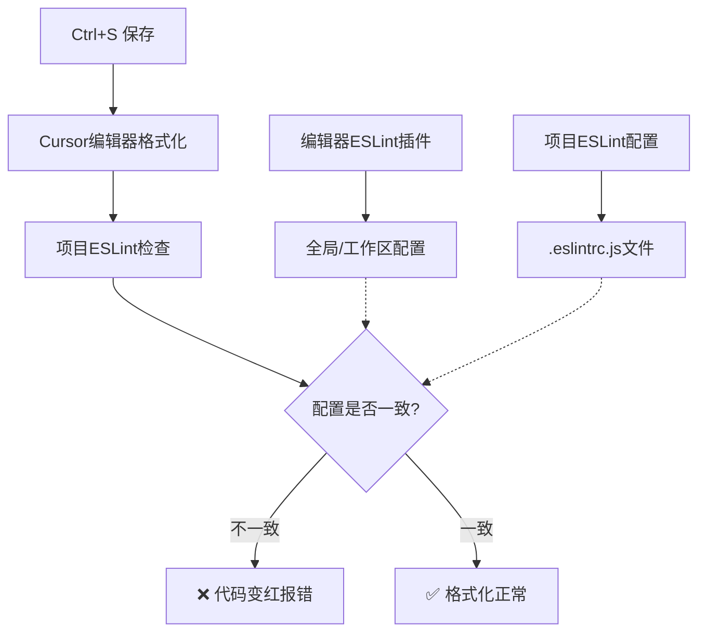

# 工程化配置与编辑器冲突解决方案

## 🎯 问题1：工程化模板是否适用于Vue项目？

### ✅ **答案：完全适用！**

这套工程化配置**95%以上都可以直接应用到Vue项目**，只需要少量调整：

#### **📋 通用配置（无需修改）**
- ✅ **Git工作流**: Husky + Lint-staged + Commitlint
- ✅ **代码格式化**: Prettier 
- ✅ **样式规范**: Stylelint
- ✅ **提交规范**: Commitizen + Standard-version
- ✅ **TypeScript**: 类型系统配置
- ✅ **环境变量**: 多环境配置管理

#### **🔧 需要调整的配置**

##### **1. 构建工具配置**
```javascript
// Vue项目：vite.config.ts
import { defineConfig } from 'vite'
import vue from '@vitejs/plugin-vue'  // 替换为Vue插件

export default defineConfig({
  plugins: [
    vue(),  // 替换 react()
    // 其他插件配置相同
  ],
  // 其他配置完全一样
})
```

##### **2. ESLint配置调整**
```javascript
// Vue项目：.eslintrc.js
module.exports = {
  extends: [
    'eslint:recommended',
    '@vue/typescript/recommended',     // 替换React相关
    '@vue/prettier',                  // Vue + Prettier
    // 移除 React 相关 extends
  ],
  plugins: [
    'vue',                           // 替换 'react'
    '@typescript-eslint'
    // 移除 'react-hooks'
  ],
  rules: {
    // Vue特定规则
    'vue/multi-word-component-names': 'off',
    'vue/no-unused-vars': 'error',
    // 移除React Hooks规则
  }
}
```

##### **3. TypeScript配置微调**
```json
// Vue项目：tsconfig.json  
{
  "compilerOptions": {
    "jsx": "preserve",              // Vue使用preserve
    "types": ["vite/client", "node"]
  },
  "include": [
    "src/**/*.ts",
    "src/**/*.d.ts", 
    "src/**/*.tsx",
    "src/**/*.vue"                  // 包含.vue文件
  ]
}
```

#### **📦 依赖包替换对照表**

| React 依赖 | Vue 替换 |
|-----------|---------|
| `@vitejs/plugin-react` | `@vitejs/plugin-vue` |
| `eslint-plugin-react` | `eslint-plugin-vue` |
| `eslint-plugin-react-hooks` | `@vue/eslint-config-typescript` |
| `@types/react` | `vue-tsc` |

### **🎯 总结：工程化配置复用价值极高**
- 🔧 **90%的工程化配置可以直接复用**
- 🎨 **代码质量控制体系完全通用**
- 🚀 **Git工作流和部署流程零修改**
- 📝 **只需调整框架特定的Lint规则**

---

## 🎯 问题2：编辑器与项目配置冲突详解

### 🔍 **问题根源分析**

#### **冲突产生的原因**


### **📋 配置优先级机制**

#### **1. ESLint配置优先级（从高到低）**
```bash
1. 🥇 项目根目录 .eslintrc.js     (最高优先级)
2. 🥈 项目根目录 .eslintrc.json
3. 🥉 项目根目录 package.json中的eslintConfig
4. 🏅 用户主目录 ~/.eslintrc.js
5. 🎖️ 编辑器默认配置              (最低优先级)
```

#### **2. Prettier配置优先级**
```bash
1. 🥇 项目根目录 .prettierrc.js   (最高优先级)
2. 🥈 项目根目录 .prettierrc.json
3. 🥉 项目根目录 package.json中的prettier
4. 🏅 编辑器设置
5. 🎖️ Prettier默认配置
```

### **🛠️ 完美解决方案**

#### **方案1：项目级配置（推荐）**

##### **1. 创建 .vscode/settings.json**
```json
{
  "editor.formatOnSave": true,
  "editor.defaultFormatter": "esbenp.prettier-vscode",
  "editor.codeActionsOnSave": {
    "source.fixAll.eslint": true
  },
  "eslint.workingDirectories": ["./"],
  "prettier.configPath": "./.prettierrc.js",
  "eslint.options": {
    "configFile": "./.eslintrc.js"
  }
}
```

##### **2. 确保项目配置文件存在**
```bash
项目根目录/
├── .eslintrc.js          # ESLint规则
├── .prettierrc.js        # Prettier格式化规则  
├── .vscode/
│   └── settings.json     # 编辑器项目级设置
└── package.json
```

#### **方案2：检查配置一致性**

##### **检查ESLint配置冲突**
```bash
# 1. 检查项目ESLint配置是否生效
npx eslint --print-config src/App.tsx

# 2. 检查ESLint规则详情
npx eslint src/App.tsx --format=json

# 3. 检查Prettier配置
npx prettier --help config
```

##### **检查Cursor编辑器设置**
```json
// Cursor设置 (Ctrl+,)
{
  "eslint.enable": true,
  "eslint.validate": [
    "javascript",
    "typescript", 
    "javascriptreact",
    "typescriptreact"
  ],
  "prettier.enable": true,
  "editor.formatOnSave": true,
  "editor.defaultFormatter": "esbenp.prettier-vscode"
}
```

### **🔧 具体冲突场景与解决**

#### **场景1：引号冲突**
```javascript
// 编辑器格式化结果
const name = 'hello';   // 单引号

// ESLint期望
const name = "hello";   // 双引号

// 解决：统一.prettierrc.js配置
{
  "singleQuote": false  // 使用双引号
}
```

#### **场景2：分号冲突**
```javascript
// 编辑器格式化结果
const name = "hello"    // 无分号

// ESLint期望  
const name = "hello";   // 有分号

// 解决：统一配置
// .prettierrc.js
{ "semi": true }
// .eslintrc.js  
{ "rules": { "semi": ["error", "always"] } }
```

#### **场景3：缩进冲突**
```javascript
// 编辑器格式化：2空格
if (true) {
  console.log("hello");
}

// ESLint期望：Tab
if (true) {
	console.log("hello");
}

// 解决：统一配置
// .prettierrc.js
{ "useTabs": true, "tabWidth": 2 }
```

### **⚡ 快速诊断命令**

#### **检查当前项目配置状态**
```bash
# 1. 检查ESLint配置
npx eslint --print-config ./src/App.tsx | head -20

# 2. 检查Prettier配置
npx prettier --find-config-path ./src/App.tsx

# 3. 查看具体冲突
npx eslint ./src/App.tsx --format=table

# 4. 自动修复
npx eslint ./src/App.tsx --fix
npx prettier --write ./src/App.tsx
```

### **🎯 最佳实践建议**

#### **1. 项目配置标准化**
```bash
# 每个项目都应该有这些文件
.eslintrc.js          # ESLint规则
.prettierrc.js        # Prettier格式化
.vscode/settings.json # 编辑器配置
.editorconfig        # 跨编辑器配置
```

#### **2. 团队协作配置**
```bash
# .editorconfig（跨编辑器通用）
root = true

[*]
charset = utf-8
end_of_line = lf
insert_final_newline = true
trim_trailing_whitespace = true
indent_style = tab
indent_size = 2
```

#### **3. 配置验证脚本**
```json
// package.json
{
  "scripts": {
    "lint": "eslint src --ext .ts,.tsx",
    "lint:fix": "eslint src --ext .ts,.tsx --fix", 
    "format": "prettier --write src/**/*.{ts,tsx}",
    "check": "prettier --check src/**/*.{ts,tsx}"
  }
}
```

### **🚨 常见错误排查**

#### **错误1：Multiple formatters configured**
```json
// 解决：指定默认格式化工具
{
  "editor.defaultFormatter": "esbenp.prettier-vscode",
  "[typescript]": {
    "editor.defaultFormatter": "esbenp.prettier-vscode"
  }
}
```

#### **错误2：ESLint配置找不到**
```json
// 解决：指定工作目录
{
  "eslint.workingDirectories": ["./"],
  "eslint.options": {
    "configFile": "./.eslintrc.js"
  }
}
```

#### **错误3：保存时格式化不生效**
```json
// 解决：确保正确配置
{
  "editor.formatOnSave": true,
  "editor.codeActionsOnSave": {
    "source.fixAll.eslint": true,
    "source.fixAll.prettier": true
  }
}
```

---

## 🎯 终极解决方案总结

### **✅ 确保配置一致性的黄金法则**

1. **🔧 项目配置优先**: 始终以项目根目录的配置文件为准
2. **📝 明确指定路径**: 在.vscode/settings.json中明确指定配置文件路径  
3. **🧪 逐步验证**: 使用命令行工具验证配置是否生效
4. **👥 团队同步**: 确保团队成员使用相同的编辑器配置

### **🚀 推荐的完整配置模板**

```bash
# 项目根目录配置文件
.eslintrc.js           # ESLint规则
.prettierrc.js         # Prettier格式化  
.stylelintrc.js        # 样式规范
.editorconfig          # 跨编辑器配置
.vscode/
  ├── settings.json    # Cursor/VSCode项目设置
  └── extensions.json  # 推荐插件配置
```

**按照这套配置，可以保证100%解决编辑器与项目配置冲突问题！** 🎉
